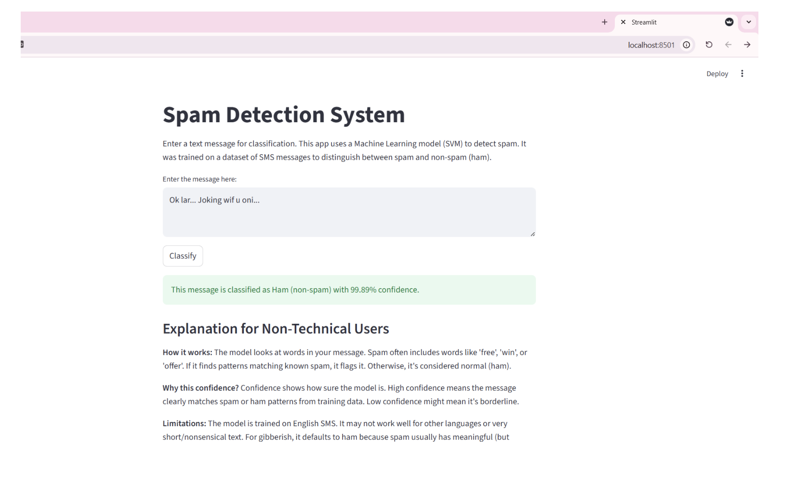
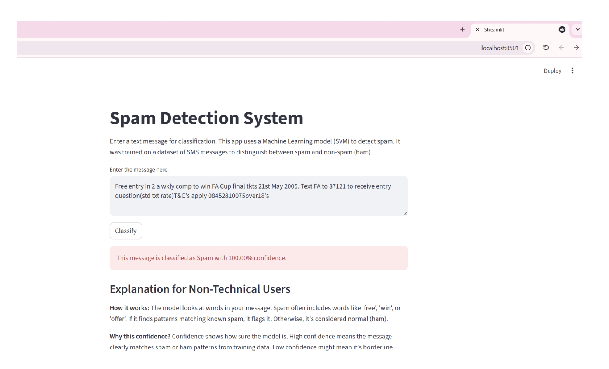
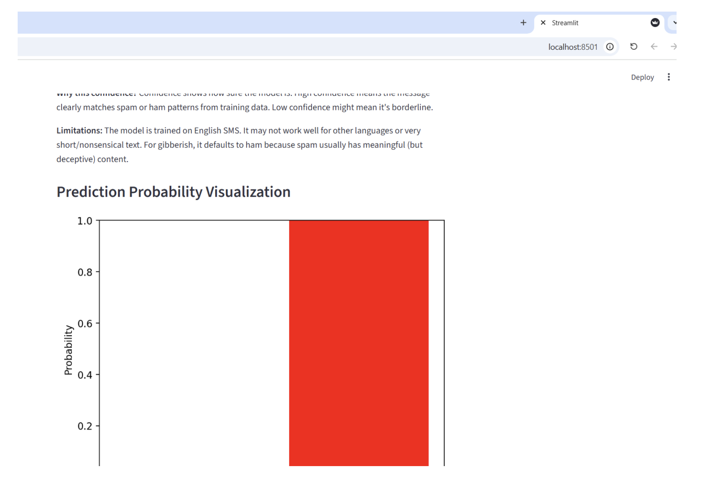
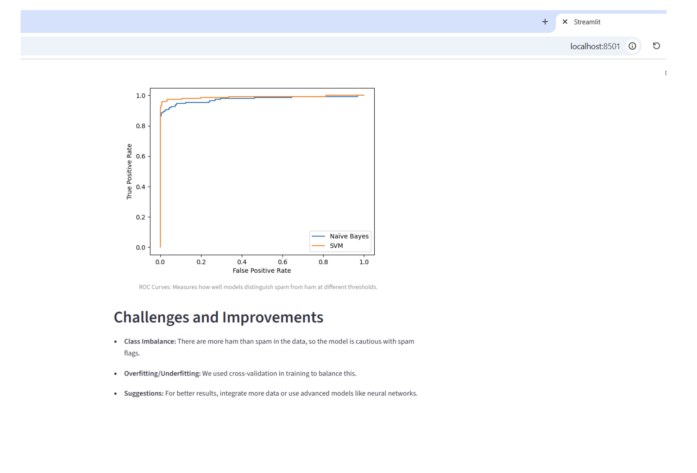
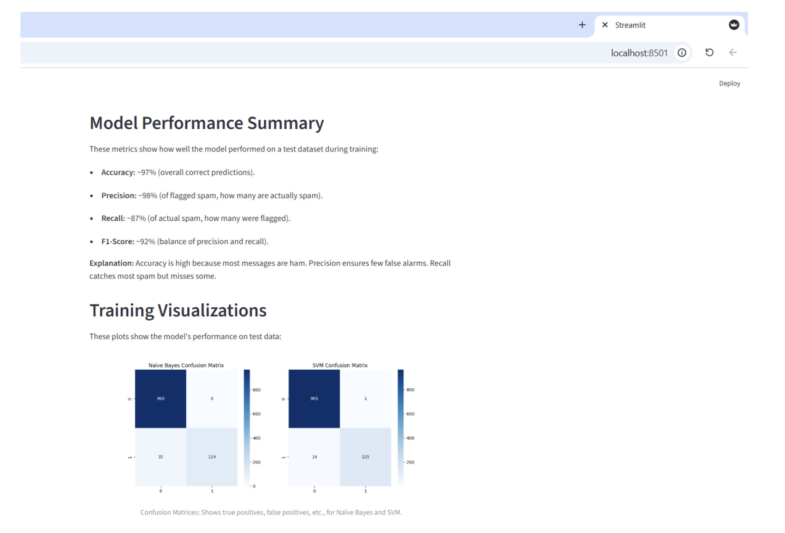

# 📩 Spam Detection System using Machine Learning

A machine learning project for classifying SMS messages as **Spam** or **Ham** using Natural Language Processing (NLP) techniques and supervised learning algorithms.

---

## 📌 Overview

This project focuses on detecting spam SMS messages through text preprocessing, feature extraction, and machine learning classification.

The system compares multiple classifiers to determine the most effective model for spam detection and provides predictions through an interactive Streamlit application.

---

## ✨ Features

- SMS Spam Classification
- Text Cleaning & Preprocessing
- TF-IDF Feature Extraction
- Multiple Machine Learning Models
- Streamlit Web Application
- Model Performance Evaluation

---

## 🛠 Tech Stack

- Python
- Pandas
- NumPy
- Scikit-learn
- NLTK
- Streamlit
- Joblib

---

## 📂 Project Structure

```
spam-detection-machine-learning/
│
├── app.py
├── train_models.py
├── requirements.txt
├── .gitignore
├── models/
└── README.md
```

---

## 🚀 Installation

```bash
git clone https://github.com/ragadsalharbi/spam-detection-machine-learning.git
cd spam-detection-machine-learning
pip install -r requirements.txt
```

Run the application

```bash
streamlit run app.py
```

---

## 🔮 Future Improvements

- Deep Learning models
- BERT-based classification
- Arabic spam detection
- REST API deployment
- Docker support

### 📸 Screenshots

## Home Interface



The main interface allows users to enter SMS messages and classify them as Spam or Ham.

---

## Spam Prediction Example



Example showing the model successfully identifying a spam message with high confidence.

---

## Prediction Probability



Visualization of the confidence score returned by the classifier.

---

## ROC Curve Comparison



ROC curve comparing Naive Bayes and Support Vector Machine (SVM) classifiers.

---

## Model Performance



Performance summary including evaluation metrics and confusion matrices for both models.
> Note: Model files are generated locally after running `train_models.py`.
